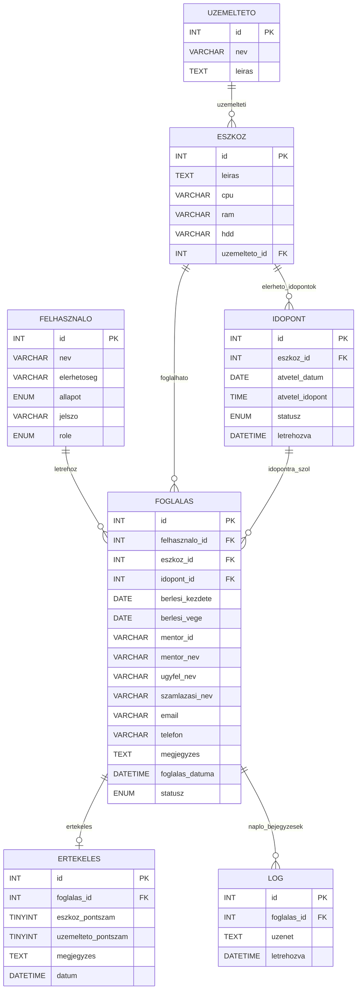

# CyberNest – Vizsgaremek 

A CyberNest egy fizikai szerverbérlési rendszer webes megvalósítása.
A projekt célja, hogy a szerverek kiválasztásától a foglaláson és adminisztráción át egy átlátható, jól bővíthető rendszert adjon.

## Projektcél

A fejlesztés fő céljai:

- egyszerűen használható, letisztult felület biztosítása a felhasználóknak
- a fizikai szerverbérlés folyamatának áttekinthető digitalizálása
- megbízható adatkezelés és jogosultságkezelés
- adminisztrációs terhek csökkentése és emberi hibák mérséklése
- moduláris felépítés a későbbi bővítésekhez (pl. riportok, statisztikák, karbantartási ütemezés)

## Csapattagok és szerepkörök

| Név | Feladatkör |
|---|---|
| Király Gellért | Frontend, Backend, Database |
| Macza Ádám | Frontend, Backend, Database |
| Kiss Richárd Bendegúz | Desktop |

## Fő funkciók

### Frontend

- Nyilvános oldalak: Home, Termékek, Termék részletek, Kapcsolat
- Ügyfélportál: Login, Register, Dashboard (védett)
- Foglalási folyamat (többlépéses): mentor választás, időpont választás, adatok, összegzés, véglegesítés
- Hibás állapotok és töltési állapotok kezelése
- JWT token alapján védett route-ok kezelése

### Backend (REST API)

- hitelesítés (regisztráció, login, profil)
- eszközök listázása, lekérdezése, admin CRUD
- időpontok listázása (elérhető / admin teljes lista), admin CRUD
- foglalás létrehozása, saját foglalások listázása, törlés
- health endpoint és debug endpointok fejlesztéshez

## Rendszerarchitektúra röviden

- **Frontend:** React + Vite + React Router
- **Backend:** Node.js + Express
- **Adatbázis:** MySQL (mysql2)
- **Auth:** JWT (Bearer token)

Adatfolyam:

1. A frontend API hívást küld a backendnek.
2. A backend ellenőrzi a tokent (ahol szükséges).
3. A backend adatbázis műveletet hajt végre.
4. JSON választ ad vissza, amit a frontend megjelenít.

## Könyvtárszerkezet

```text
website/
  backend/
    config/
    controllers/
    middleware/
    models/
    routes/
    server.js
    setup.sql
    .env
  frontend/
    src/
      context/
      layout/
      pages/
      services/
      styles/
    index.html
  package.json (workspace root)
```


# Telepítés és futtatás

### Előkövetelmények

A projekt futtatásához az alábbi programoknak telepítve kell lenniük a számítógépen:

- **Node.js 18 vagy újabb**
- **npm 9 vagy újabb**
- **MySQL 8+** (vagy MariaDB kompatibilis)
- **Git**

Ellenőrzéshez nyisd meg a **Parancssort (CMD)** és írd be:

```bash
node -v
npm -v
git --version
````

Ha mindegyik verziószámot visszaad, akkor a szükséges programok telepítve vannak.

---

# 1) Repository klónozása

Először le kell tölteni (klónozni) a projektet a Git repositoryból.

### 1. Parancssor megnyitása

1. Nyomd meg a **Windows + R** billentyűket
2. Írd be:

```bash
cmd
```

3. Nyomd meg az **Enter** billentyűt

Ezzel megnyílik a **Parancssor (Command Prompt)**.

---

### 2. Lépj abba a mappába, ahová a projektet le szeretnéd tölteni

Példa: ha az **Asztalra** szeretnéd klónozni:

```bash
cd Desktop
```

Ha más mappába szeretnéd, akkor annak az útvonalát kell megadni.

---

### 3. A repository klónozása

Másold be a következő parancsot a parancssorba:

```bash
git clone https://github.com/Wolfboy64/vizsgaremek.git
```

Majd nyomj **Entert**.

A Git ekkor letölti a projekt teljes tartalmát.

## Átváltás a megfelelő branch-re

A projekt weboldal része egy külön website branch-ben található, ezért a klónozás után át kell váltani erre a branch-re.

Először lépj be a letöltött repository mappájába:

cd vizsgaremek

Ezután válts át a website branch-re:

git checkout website

Ez a parancs átvált a website branch-re, ahol a teljes webalkalmazás található.

---

### 4. Belépés a projekt mappájába

A klónozás után lépj be a projekt fő mappájába:

```bash
cd website
```

---

### 5. A projekt mappastruktúrája

A klónozás után a következő struktúra lesz látható:

```
VIZSGAREMEK
│
└── website
    ├── backend
    ├── frontend
    ├── package.json
    ├── package-lock.json
    ├── start.bat
    └── README.md
```

A projekt indításához **mindig a `website` mappában kell lenni**, mert itt található a fő konfiguráció.

---

# 2) Függőségek telepítése és projekt indítása

A projekt kétféleképpen indítható.

---

# Manuális indítás (terminálból)

Miután beléptél a `website` mappába, futtasd a következő parancsot:

```bash
npm install
```

Ez automatikusan telepíti:

* a **backend csomagokat**
* a **frontend csomagokat**
* létrehozza a **node_modules** mappát

A telepítés után indítsd el az alkalmazást:

```bash
npm run dev
```

Ez egyszerre elindítja:

* a **backend szervert**
* a **frontend Vite fejlesztői szervert**

Az alkalmazás ezután elérhető lesz a böngészőben:

```
http://localhost:5173
```

---

# Egyszerű indítás (ajánlott)

A projekt tartalmaz egy automatikus indító fájlt, amely minden szükséges lépést elvégez.

Fájl neve:

```
start.bat
```

Helye:

```
VIZSGAREMEK
└── website
    └── start.bat
```

### Indítás lépései

1. Nyisd meg a **VIZSGAREMEK** mappát
2. Lépj be a **website** mappába
3. Keresd meg a **start.bat** fájlt
4. **Dupla kattintással indítsd el**

Az indító fájl automatikusan:

1. telepíti a szükséges csomagokat (`npm install`)
2. elindítja a backend szervert
3. elindítja a frontend fejlesztői szervert
4. megnyitja a böngészőt

Ezután az alkalmazás automatikusan elérhető lesz:

```
http://localhost:5173
```

---


### 3) Környezeti változók beállítása

Backend oldalon a `website/backend/.env` fájlban:

| Változó | Leírás | Példa |
|---|---|---|
| `DB_HOST` | Adatbázis host | `localhost` |
| `DB_USER` | Adatbázis felhasználó | `root` |
| `DB_PASSWORD` | Adatbázis jelszó | `root` |
| `DB_NAME` | Adatbázis neve | `cybernest` |
| `DB_PORT` | Adatbázis port | `3306 + 3307` |
| `JWT_SECRET` | JWT aláírási kulcs | `nagyon-eros-titok` |
| `PORT` | Backend port | `5050` |
| `CLIENT_URL` | Frontend URL (CORS) | `http://localhost:5173` |

### 4) Fejlesztői futtatás (frontend + backend egyszerre)

```bash
npm run dev
```

Alap URL-ek:

- Frontend: `http://localhost:5173`
- Backend API: `http://localhost:5050/api`
- Backend adatbázis nézet: `http://localhost:5050`

### 5) Production jellegű indítás (egyszerű)

```bash
npm run start
```

## NPM scriptek

### Workspace root (`website/package.json`)

| Script | Jelentés |
|---|---|
| `npm run dev` | Backend (`nodemon`) + frontend (`vite`) párhuzamos indítása |
| `npm run start` | Backend start + frontend preview |

### Frontend (`website/frontend/package.json`)

| Script | Jelentés |
|---|---|
| `npm run dev -w frontend` | Vite dev szerver |
| `npm run build -w frontend` | Frontend build |
| `npm run preview -w frontend` | Build preview |
| `npm run lint -w frontend` | ESLint |

### Backend (`website/backend/package.json`)

| Script | Jelentés |
|---|---|
| `npm run dev -w backend` | Nodemon fejlesztői futtatás |
| `npm run start -w backend` | Backend indítás |

## Frontend oldalak (aktuális route-ok)

| Route | Hozzáférés | Leírás |
|---|---|---|
| `/` | public | Nyitóoldal |
| `/termekek` | public | Szerverlista |
| `/termekek/:id` | public | Szerver részletek |
| `/termekek/:id/foglalas` | védett | Foglalási folyamat |
| `/kapcsolat` | public | Kapcsolat oldal |
| `/ugyfelportal/login` | public | Bejelentkezés |
| `/ugyfelportal/register` | public | Regisztráció |
| `/ugyfelportal/dashboard` | védett | Ügyfél dashboard |

## API dokumentáció

API base URL:

- `http://localhost:5000/api`

Auth format (védett endpointok):

```http
Authorization: Bearer <jwt_token>
```

### Hitelesítés

| Method | Endpoint | Auth | Leírás |
|---|---|---|---|
| `POST` | `/api/auth/register` | Nem | Új felhasználó regisztráció |
| `POST` | `/api/auth/login` | Nem | Bejelentkezés, JWT visszaadás |
| `GET` | `/api/auth/me` | Igen | Saját profil lekérdezése |

Példa login request:

```json
{
  "elerhetoseg": "user@example.com",
  "jelszo": "Titkos123"
}
```

### Eszköz endpointok

| Method | Endpoint | Auth | Szerepkör | Leírás |
|---|---|---|---|---|
| `GET` | `/api/eszkoz` | Nem | - | Összes eszköz listázása |
| `GET` | `/api/eszkoz/:id` | Nem | - | Eszköz részletek |
| `POST` | `/api/eszkoz` | Igen | admin | Új eszköz létrehozása |
| `PUT` | `/api/eszkoz/:id` | Igen | admin | Eszköz módosítása |
| `DELETE` | `/api/eszkoz/:id` | Igen | admin | Eszköz törlése |

### Foglalás endpointok

| Method | Endpoint | Auth | Szerepkör | Leírás |
|---|---|---|---|---|
| `POST` | `/api/foglalas` | Igen | user/admin | Új foglalás létrehozása |
| `GET` | `/api/foglalas/my` | Igen | user/admin | Bejelentkezett user saját foglalásai |
| `GET` | `/api/foglalas` | Igen | admin | Összes foglalás listázása |
| `DELETE` | `/api/foglalas/:id` | Igen | user/admin | Foglalás törlése (jelenlegi route szerint auth kell, nem csak admin) |

> Megjegyzés: a `DELETE /api/foglalas/:id` endpoint jelenlegi route-konfigurációja tokenes hozzáférést követel, de nem admin-only.

### Időpont endpointok

| Method | Endpoint | Auth | Szerepkör | Leírás |
|---|---|---|---|---|
| `GET` | `/api/idopont/eszkoz/:eszkoz_id` | Nem | - | Eszközhöz tartozó elérhető időpontok |
| `GET` | `/api/idopont` | Igen | admin | Összes időpont listázása |
| `GET` | `/api/idopont/:id` | Nem | - | Időpont részletek |
| `POST` | `/api/idopont` | Igen | admin | Új időpont létrehozása |
| `PUT` | `/api/idopont/:id` | Igen | admin | Időpont módosítása |
| `DELETE` | `/api/idopont/:id` | Igen | admin | Időpont törlése |

### Egyéb és debug endpointok

| Method | Endpoint | Auth | Leírás |
|---|---|---|---|
| `GET` | `/api/health` | Nem | Health check |
| `GET` | `/` | Nem | HTML debug nézet adatbázis táblákkal |
| `GET` | `/api/debug/users` | Nem (dev cél) | Felhasználók listája debughoz |

## HTTP státuszkódok (irányadó)

| Kód | Jelentés |
|---|---|
| `200` | Sikeres lekérdezés / módosítás |
| `201` | Sikeres létrehozás |
| `400` | Hibás vagy hiányos input |
| `401` | Nincs vagy érvénytelen token |
| `403` | Nincs jogosultság |
| `404` | Erőforrás nem található |
| `500` | Szerverhiba |

## Adatbázis és inicializálás

- A backend induláskor automatikusan inicializálja az adatbázist a `setup.sql` alapján.
- Ha a DB nem létezik, létrehozza.
- Létrehozza az alap admin felhasználót (`admin@local`) lokális fejlesztéshez.
- Feltölti az alap üzemeltető + eszköz adatokat.
- Feltölti a jövő idejű foglalható időpontokat (duplikáció ellenőrzéssel).

Fő táblák:

- `felhasznalo`
- `uzemelteto`
- `eszkoz`
- `idopont`
- `foglalas`
- `ertekeles`
- `log`

## Biztonság és megbízhatóság

- JWT alapú hitelesítés védett endpointokhoz
- Admin endpointoknál szerepkör ellenőrzés
- CORS szabályok `CLIENT_URL` alapon
- SQL műveletek paraméterizált query-kkel (`mysql2`)
- Központi hiba- és 404 kezelés

## Hibaelhárítás

### Nem jönnek időpontok a frontendre

- Ellenőrizd, hogy fut-e a backend (`/api/health`)
- Ellenőrizd az adatbázis kapcsolatot (`DB_*` változók)
- Ellenőrizd, hogy van-e `available` státuszú, mai vagy jövőbeni dátumú időpont az `idopont` táblában

### CORS hiba

- Ellenőrizd a `CLIENT_URL` értéket a backend `.env` fájlban
- Ellenőrizd, hogy frontend valóban ugyanazon URL-ről fut

### Auth hiba (401/403)

- Ellenőrizd a `Authorization: Bearer <token>` header-t
- Ellenőrizd, hogy a token nem járt-e le
- Admin művelethez admin szerepkörű user kell

## Bővítési lehetőségek (roadmap)

- automatizált riportok
- statisztikai dashboardok
- karbantartási ütemezés modul
- email értesítések
- audit naplózás és finomabb jogosultságmodell

---

## Adatbázis ER Diagram (teljes séma)



## Megjegyzés

Ez a README az aktuális kódállapothoz igazított, részletes dokumentáció.
A rendszer tovább bővíthető több modulra bontott, szolgáltatás alapú architektúrára is.
